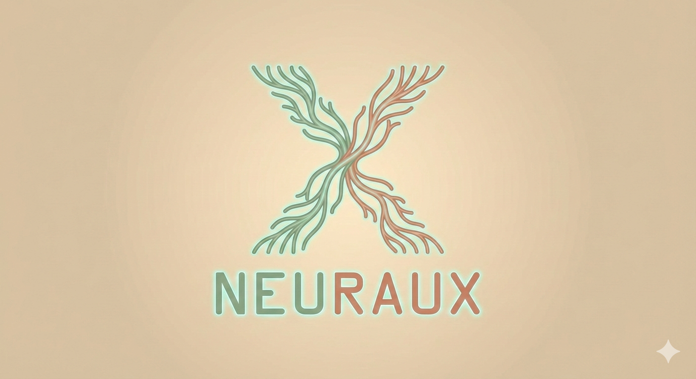

# Neuraux

    

An agentic development framework focused on **collaboration and assistance** over pure automation.

> ⚠️ **Preview release**: Neuraux is still heavily work in progress and under active testing.

## ✨ What is Neuraux?

Neuraux is a larger framework currently being built in pieces.

The **Specification Agent** is the first publicly available piece. It helps developers produce structured, behavior-first software specifications while keeping architecture and implementation details out of scope.

## 🧩 Current Component: Specification Agent

The specification agent is a multi-agent pack located in [specification-agent](specification-agent), with the canonical output contract documented in [specification-agent/SPECIFICATION.md](specification-agent/SPECIFICATION.md).

It is designed to support:
- Requirement clarity and traceability
- Decision tracking across specification cycles
- Scope/lane validation to reduce architecture leakage
- Consistency and quality checks across generated spec artifacts

## 🚀 Quick Usage Guide

### 1) Add the agent pack to your repository

Copy the agent definitions from:
- [specification-agent/.github/agents](specification-agent/.github/agents)

into your project’s `.github/agents` directory.

### 2) Start the orchestrator

Invoke the orchestrator agent:
- **Agent name**: `Specification - Orchestrator`
- **Kickoff**: Describe what you want to build—the problem you're solving, the core features, and the main users involved. The agent will ask clarification questions and guide you through structured specification authoring.

### 3) Iterate

Use collaborative cycles with the agent. You can:
- Answer clarification questions
- Offer feedback on written specifications
- Steer the conversation toward different topics
- Add or remove scope items as needed
- Confirm or challenge decisions

The agent handles the writing, maintains traceability, and fact-checks everything continuously.

For the full behavioral contract, see:
- [specification-agent/SPECIFICATION.md](specification-agent/SPECIFICATION.md)

## 🛠️ Known Issues (Specification Agent)

Current known issues include:
1. Output is not always easily human-readable.
2. Agent runs can be slow.
3. Consistency issues can occasionally appear.
4. The agent may ask redundant questions or miss important ones.
5. The agent sometimes steers from the prescribed document structure.
6. The glossary is underspecified and can become bloated with irrelevant terms and behavioral descriptions instead of brief definitions for  domain-specific terms.

**Coming next**: Prompt optimization and instruction fine-tuning are deferred until core functionality stabilizes.

## 🗺️ Roadmap

- ✅ Specification Agent (preview)
- ⏳ Architecture Agent (planned next)
- 🔭 Additional Neuraux agents are planned after that

## 📌 Status

This repository currently showcases the first Neuraux building block and is intended for preview usage, testing, and feedback.

If you're evaluating it today, expect active iteration and occasional rough edges.