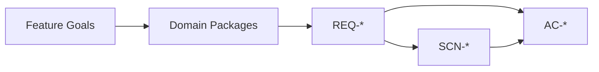
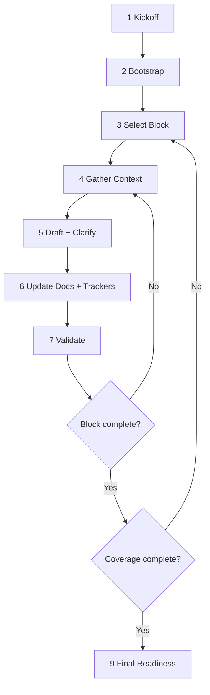
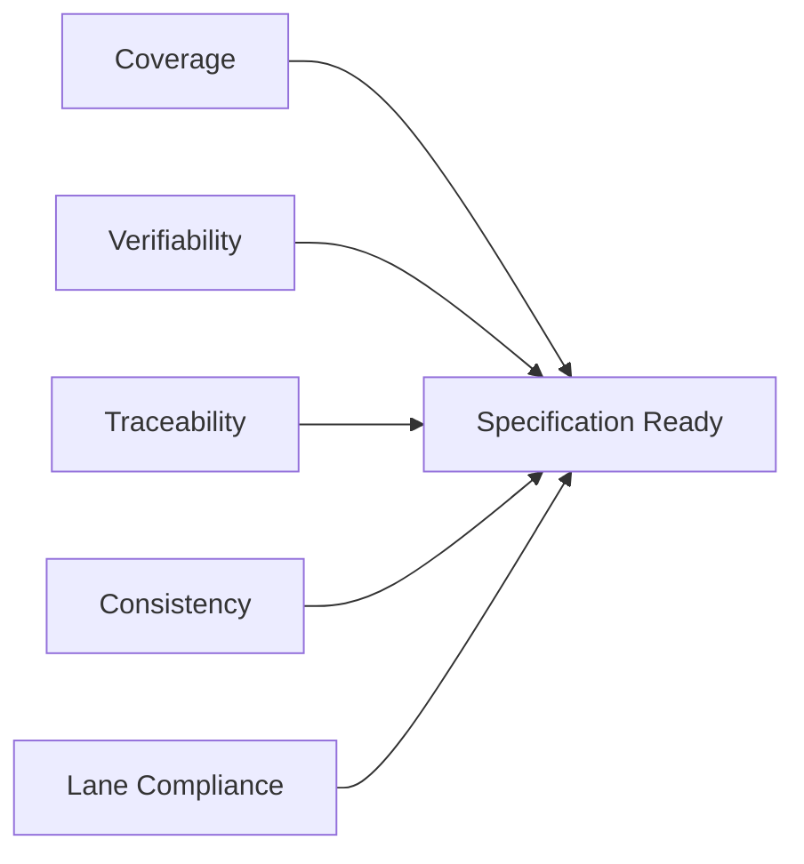

# Specification Agent: Output Specification

**Status**: Design Phase  
**Last Updated**: 2026-02-22  
**Owner**: Specification Agent Design

---

## 1) Purpose

The Specification Agent produces **behavioral software specifications** that clearly state:
- what the system must do,
- for whom,
- under which constraints,
- and how outcomes are verified.

The output must be readable by product, QA, architecture, and engineering teams, and must stay implementation-agnostic.

---

## 2) Scope and Boundaries

### In scope
- Feature goals and experience outcomes
- Scope boundaries (in/out)
- User/actor capabilities
- Normal, alternate, and error behaviors
- Domain and cross-domain rules
- Acceptance criteria and traceability

### Out of scope
- Architecture decomposition
- Data storage design (schemas, fields, indexes, identifiers)
- Framework/library selection
- Deployment topology
- Code generation

### Boundary guardrails
- Define **experience intent**, not visual UI styling.
- Define **behavioral domain concepts**, not physical data models.

---

## 3) Core Principles

- **Domain-first**: organize by feature/domain package, not by generic artifact type.
- **Behavior-first**: requirements describe observable behavior.
- **Testable writing**: every requirement is atomic, explicit, and verifiable.
- **Traceable outputs**: goals -> domains -> requirements -> scenarios -> acceptance.
- **Lane discipline**: no architecture or implementation leakage.

---

## 4) Canonical Output Structure

```text
docs/specification/
├── README.md
├── .progress.md                 # operational
├── .decisions.md                # operational
├── .volatile-notes.md           # operational
├── 01-experience-vision.md
├── 02-software-context-feature-goals.md
├── 03-user-roles-interaction-profiles.md
├── 04-global-scope-constraints.md
├── 05-cross-domain-policies.md
├── 06-glossary.md               # living asset
├── domains/
│   └── [feature-slug]/
│       ├── 01-overview.md
│       ├── 02-requirements.md
│       ├── 03-workflows.md
│       ├── 04-rules.md
│       └── 05-acceptance.md
└── traceability/
    └── requirements-traceability.md
```

### Structure rules (strict)
- Domain folder format: lowercase kebab-case (example: `billing-subscriptions`).
- Domain filenames are fixed and must not be renamed.
- No extra artifact variants unless explicitly requested by the user.
- If an exception is requested, record it in `docs/specification/README.md` under **Structure Exceptions**.

---

## 5) Global Backbone (Required Files)

1. **README**: navigation, audience, change policy.
2. **Experience Vision**: north star and experience promise.
3. **Software Context & Feature Goals**: problem, outcomes, users, validation signals.
4. **User Roles & Interaction Profiles**: role catalog and touchpoints.
5. **Global Scope & Constraints**: in/out, dependencies, constraints.
6. **Cross-Domain Policies**: shared rules and policy precedence.
7. **Glossary**: canonical terminology (continuous maintenance).

---

## 6) Domain Package Contract (Required)

Each in-scope domain must include five files.

### 6.1 `01-overview.md`
Required content:
- Domain purpose
- Actor/role coverage
- In-scope capabilities
- Out-of-scope clarifications
- Dependencies on other domains

Allowed: conceptual entities, roles, states, behavioral constraints.  
Not allowed: field/type definitions, schema details, identifier strategy, implementation grouping.

### 6.2 `02-requirements.md`
Requirement ID format: `REQ-[DOMAIN]-NNN`

Each requirement includes:
- ID
- Statement (`System must ...` / `User must be able to ...`)
- Rationale
- Priority (`P0 | P1 | P2`)
- Source
- Related scenarios (`SCN-*`)
- Related acceptance criteria (`AC-*`)

### 6.3 `03-workflows.md`
Scenario ID format: `SCN-[DOMAIN]-NNN`

Each scenario includes:
- ID + title
- Trigger
- Preconditions
- Main flow (numbered)
- Alternate flows
- Error flows
- Postconditions
- Related requirements

### 6.4 `04-rules.md`
Rule ID format: `RULE-[DOMAIN]-NNN`

Each rule includes:
- ID
- Rule statement
- Scope
- Violation behavior
- Related requirements/scenarios

### 6.5 `05-acceptance.md`
Acceptance ID format: `AC-[DOMAIN]-NNN`

Each criterion includes:
- ID
- Given/When/Then statement
- Verification notes
- Related requirement IDs
- Related scenario IDs

---

## 7) Traceability Standard

Minimum required traceability:
- Goal -> Domain -> Requirement -> Scenario -> Acceptance
- Requirement -> Acceptance

Required artifact:
- `docs/specification/traceability/requirements-traceability.md`



---

## 8) Writing Rules

- Use mandatory, testable language.
- Keep one behavior per requirement when possible.
- Replace ambiguous terms with measurable language.
- Describe interaction outcomes, not visual styling.
- Mark unresolved uncertainty as explicit open questions.

---

## 9) Operational Memory (Non-Output)

Operational files support continuity but do not define requirements:
- `.progress.md`
- `.decisions.md`
- `.volatile-notes.md`

Authority order:
1. Latest explicit user stance
2. Canonical specification markdown
3. Operational memory files

Rules:
- Operational memory cannot introduce new requirements by itself.
- Stable facts should be promoted into canonical docs quickly.

### Volatile note integrity
- `CONFIRMED` notes require explicit user evidence.
- Inferences are `TENTATIVE` until user confirmation.
- One fact per note.
- Every note must include user-turn traceability.
- Avoid architecture/implementation content unless explicitly user-scoped.

---

## 10) Progress Tracking Contract

Progress is tracked in `docs/specification/.progress.md`.

Required blocks:
1. Scope confirmation
2. Global baseline (`G00`-`G04`)
3. Living assets (`L00` glossary, continuous)
4. Domain blocks (`Dxxxx`)
5. Traceability health

### Domain block status rule
A domain is `DONE` only when all mandatory coverage checks are complete.

### Domain ID assignment
- Read existing `[Dxxxx]` IDs.
- New ID = `max + 1` with 4-digit format.
- Never reuse gaps.
- Deleting a domain does not renumber others.

---

## 11) Collaborative Workflow (9 Steps)

1. Kickoff alignment
2. Bootstrap planning state
3. Select active topic/block
4. Gather context
5. Draft collaboratively (with targeted questions/options)
6. Update artifacts and trackers
7. Validate quality/consistency/lane
8. Repeat by topic until coverage complete
9. Final readiness pass



---

## 12) Orchestration Model (Condensed)

### Role model
- **Orchestrator** owns phase, step, active block, and user cadence.
- **Specialists** are invoked by orchestrator only; no specialist-to-specialist chaining.
- No recommendation becomes a requirement without explicit user confirmation.

### Mandatory control points
- Question refinement loop: max 3 rounds.
- Quality/consistency correction loop: max 2 rounds before user checkpoint.
- Specialist retry cap: 3 attempts per call instance.
- Parallel bundles require correlation contract (`bundle_id`, fingerprint echo, join gate pass).

### Lane check output (required)
- `lane_status`: pass | fail
- `violations`: list
- `handoff_needed`: yes | no
- `handoff_note`: required if handoff is needed

---

## 13) Quality Bar (Definition of Complete)

Specification is complete only when all are true:
- Vision and feature goals are explicit and non-contradictory.
- All in-scope concerns have domain packages.
- Each domain contains overview/requirements/workflows/rules/acceptance.
- Every requirement is atomic, testable, and linked to >=1 acceptance criterion.
- IDs are unique per family (`REQ`, `SCN`, `RULE`, `AC`).
- Traceability index is synchronized.
- Terminology is consistent with glossary.
- No architecture or implementation leakage remains.



---

## 14) Visualization Guidance (Practical)

Use visuals only when they improve understanding. Mermaid is preferred.

Recommended by artifact:
- Vision/goals: goal hierarchy or actor map
- Scope/constraints: boundary diagram
- Domain workflows: swimlane or error-flow tree
- Rules: decision tree for complex branching
- Traceability/progress: coverage dashboard or completion chart

Do not add visuals that duplicate obvious text.

---

## 15) Reference Formats (Examples)

### Requirement

```markdown
ID: REQ-BILLING-004
Statement: System must allow an account owner to update the payment method for an active subscription.
Rationale: Prevent avoidable payment failures and preserve a smooth subscription experience.
Priority: P1
Source: User support feedback 2026-02-18
Related Scenarios: SCN-BILLING-002
Related Acceptance Criteria: AC-BILLING-006, AC-BILLING-007
```

### Scenario

```markdown
ID: SCN-BILLING-002
Trigger: Account owner selects "Update payment method" from subscription settings.
Preconditions: User is authenticated and owns the target subscription.
Main Flow:
1. User enters replacement payment details.
2. System validates required fields and format.
3. System confirms update success.
Alternate Flows:
- Validation failure: system indicates errors and preserves entered data where allowed.
Error Flows:
- External payment provider unavailable: system reports temporary failure and no method is changed.
Postconditions: If successful, the new payment method becomes the active default for future billing cycles.
Related Requirements: REQ-BILLING-004
```

### Acceptance Criterion

```markdown
ID: AC-BILLING-006
Given an authenticated account owner with an active subscription,
When valid replacement payment details are submitted,
Then the subscription's active payment method is updated and a success confirmation is shown.
Verification Notes: Validate that future billing uses the replacement method.
Related Requirements: REQ-BILLING-004
Related Scenarios: SCN-BILLING-002
```

---

## 16) References

- Arc42: https://arc42.org
- ISO/IEC/IEEE 29148 (requirements quality concepts)
- IREB / INCOSE guidance (clarity, consistency, verifiability)